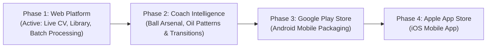

# Live Bowling Tracker & 24/7 AI Coach 🎳

An AI-powered computer-vision bowling coach that tracks biomechanics, trajectory, ball speed, rev rate (RPM), breakpoint, and scoring from standard phone video recordings (including 240 FPS slow-motion clips).

---

## 🎯 Project Vision & Mission

The goal of this project is to develop a **24/7 AI Personal Bowling Coach in your pocket**. 
- **Current Stage**: Modern responsive web application for rapid validation, video library browsing, continuous shot processing, and personal bowler fingerprint training.
- **Next Stage**: Android mobile application released to the **Google Play Store**, followed by the **Apple App Store**.

---

## 👤 Primary Bowler Profile (2-Handed Lefty)

The system is configured with dedicated physics and biomechanics calibration for a **2-Handed Left-Handed** delivery:
- **Slide Leg**: **Right Leg** (slide knee flexion measures the right knee driving into the foul line, while the left trailing leg stays unweighted).
- **USBC Lefty Board Indexing**:
  - **Board 1**: Far Left Gutter (outside left rail)
  - **Board 20**: Center Dot / Center Arrow
  - **Board 39**: Far Right Gutter
- **Pocket Target**: **1-2 Pocket** (Pins 1 and 2).
- **Dual-Hand Wrist Midpoint**: Ball tracking proxy accounts for both hands cradling the ball through backswing until uncoupling at release.

*(Note: Right-handed and 1-handed deliveries are fully supported via the UI dropdowns or auto-detection).*

---

## 🚀 Key Features

### 1. High-Precision Biomechanics Tracking
- Powered by Google **MediaPipe Pose Heavy** (`models/pose_landmarker_heavy.task`) with rolling-window outlier rejection.
- Computes per-frame:
  - **Spine Tilt Angle**: Trunk inclination relative to vertical.
  - **Slide Knee Flexion**: Degree of knee compression at foul line plant/slide.
  - **Hip-to-Shoulder Separation**: Torso coil / "X-Factor" during backswing.
  - **Lateral Ball-to-Ankle Clearance**: Distance of ball release relative to slide ankle.

### 2. Slow-Motion & High-Frame-Rate Calibration
- Phones recording high-speed slow-mo (e.g. 240 FPS stored at 60 FPS) previously caused rev rates and ball velocities to read artificially low ($1/4\text{th}$ real speed).
- Built-in **Auto-SloMo Detection**:
  - Clips $\ge 13\text{s}$ are automatically scaled with a **4.0× multiplier** (calibrating release velocity to real-world 15–18 mph and rev rate to 400–520 RPM for 2-handed bowlers).
  - Clips between 8s and 13s apply a **2.0× multiplier**.
  - Manual overrides (1×, 2×, 4×, 8×) are selectable in the UI.

### 3. Video Library with Picture Previews & GPS Geolocation
- **Thumbnail Previews**: Automated JPEG extraction around bowler setup/approach, cached locally in `data/thumbnails/` with lazy loading.
- **Metadata Extraction**: Date, time, file size, duration, and resolution (HD to 4K).
- **ISO-6709 Geolocation**: Extracts GPS coordinates embedded in phone MP4 containers (e.g. Singapore bowling alleys) with direct links to Google Maps.

### 4. Background Batch Annotation Pipeline
- Batch runner (`scripts/batch_annotate.py`) processes entire video libraries in the background.
- **Deduplication**: Automatically removes redundant uploads.
- **Skip Logic**: Checks `data/output/` and skips previously processed videos so no compute is wasted.
- **Native Browser Playback**: Transcodes annotated clips to standard H.264 MP4 (`yuv420p` + `faststart`) for instant in-browser Chrome/Safari video playback without buffering.

### 5. Live Dashboard Progress Bar & Real-Time Controls
- Displays real-time progress across training clips (e.g., `32 / 77 Videos Annotated (41.6%)`).
- Real-time animated progress bar with **Live ETA Countdown**.
- Live controls to **Pause**, **Resume**, and jump directly to **"📂 View Processed Shots"**.

---

## 🗺️ Product & App Roadmap



- [x] **Phase 1: Web Platform & Vision Pipeline** (Current)
  - Responsive web dashboard (FastAPI + Jinja2 + Vanilla JS).
  - MediaPipe Heavy Pose Landmarker integration.
  - 2-Handed Lefty biomechanics & board numbering.
  - Slow-motion multiplier calibration.
  - Video library with thumbnails and ISO-6709 GPS geolocation.
  - Batch annotation runner with live dashboard progress bar.
- [ ] **Phase 2: Bowling Coach Intelligence**
  - **Ball Arsenal Tracker**: Catalog balls by coverstock (Solid, Pearl, Hybrid, Urethane) and core specs (Symmetrical vs Asymmetrical).
  - **Oil Pattern & Transition Advisor**: Detect lane breakdown and recommend moves inside or ball changes.
  - **Center & Lane Memory**: Save performance profiles by bowling center and lane numbers.
- [ ] **Phase 3: Google Play Store Release (Android)**
  - Wrap frontend with Capacitor / Trusted Web Activity (TWA) or React Native.
  - Direct camera capture with auto-crop for bowling approaches.
- [ ] **Phase 4: Apple App Store Release (iOS)**
  - Native iOS build with offline storage sync.

---

## 💻 Multi-Machine Setup Guide

To pull this repository and continue development or run on another machine:

### 1. Clone & Set Up Python Environment

```bash
git clone https://github.com/labjankiness/live-bowling-tracker.git
cd live-bowling-tracker

# Create virtual environment
python3 -m venv venv
source venv/bin/activate    # On Windows: venv\Scripts\activate

# Install dependencies
pip install -r requirements.txt
```

### 2. Download MediaPipe Pose Heavy Model

```bash
mkdir -p models
curl -sSL -o models/pose_landmarker_heavy.task \
  https://storage.googleapis.com/mediapipe-models/pose_landmarker/pose_landmarker_heavy/float16/latest/pose_landmarker_heavy.task
```

### 3. Launch Web Dashboard

```bash
# Optional: Set session passcode (default: bowling2026)
export BOWLING_SECRET_KEY="bowling2026"

# Run Uvicorn server
uvicorn web.app:app --host 0.0.0.0 --port 8000 --reload
```
Open **`http://localhost:8000/`** in your browser and enter passcode `bowling2026`.

### 4. Run Batch Video Annotation (CLI)

To process or resume batch annotation across your training folder:

```bash
# Full background run (auto-skips existing videos, 2-handed lefty profile)
python scripts/batch_annotate.py --handedness left --style 2-handed --speed-factor auto

# Test run on next 1 video only
python scripts/batch_annotate.py --max 1
```

### 5. Multi-Source Upload & Cloud Integration
The platform supports multi-source uploads directly from the dashboard:
- **Local Drag & Drop**: Instant file streaming and progress indication.
- **Microsoft OneDrive Picker**: Direct integration via the Microsoft OneDrive Picker v7.2 SDK.
- **Google Drive Sync**: Service account / user authentication sync for video datasets.

### 6. Approach Timing & Phase Synchronizer Model
The approach timing model decomposes each shot into 5 biomechanical milestones:
1. `Pushaway`
2. `Top Apex` (highest point of backswing)
3. `Power Step` (pre-slide stride)
4. `Release`
5. `Finish Hold` (balance hold)

To train or benchmark the Temporal Convolutional Network (TCN) on your hardware (CPU, AMD DirectML, or NVIDIA CUDA):
```bash
python scripts/train_timing_gpu.py
```

### 7. Bowling Ball Specification, Master Database & "My Arsenal" Manager
- **1,764+ Master Ball Database**: Covers all new, current, and retired/vintage models across 6 major manufacturers:
  - **Storm Bowling** (627 models: Phaze, Hy-Road, !Q Tour, Summit, Absolute, DNA, Crux, Code, Marvel, etc.)
  - **Hammer Bowling** (326 models: Black Widow, Zero Mercy, Effect, Vibe, Purple Pearl Urethane, etc.)
  - **Ebonite Bowling** (264 models: The Great One, Turbo X, Game Breaker series, Matrix, Warrior, etc.)
  - **Brunswick Bowling** (221 models: Combat, Warning Alert, Quantum, Danger Zone, Rhino, Inferno, etc.)
  - **Motiv Bowling** (194 models: Jackal series, Venom Shock, Raptor, Forge, Tank Microcell, etc.)
  - **Radical Bowling** (132 models: Evil Eye, Intel Tour, Deadly Rattler, Outer Limits, Zigzag, etc.)
- **"My Arsenal & PAP" Manager**:
  - Save your personal **Positive Axis Point (PAP)** coordinates (horizontal & vertical offset).
  - Configure custom drilled balls using **Storm Dual Angle** (Drilling × Pin-PAP × VAL) or **2LS (Two-Handed Layout System)**.
  - Track customized surface preparation grits (e.g. 2000-grit TruCut, Box Finish, 1000-grit Siaair).
  - Selected arsenal balls dynamically adjust skid factor, flare potential, and trajectory modifiers in the analytics engine.
- **Auto-Detection & Real-Time Search**:
  - Samples ball crops around release using HSV color-space matching for iconic balls.
  - Interactive dashboard search combobox with instant substring indexing, brand badges, and `Current` / `Retired` status pills.

### 8. Dual-Shot Side-by-Side Video Comparison ("Ghost Mode")
- Compare any two shots from your library simultaneously with synchronized play/pause and rewind controls.
- Interactive **Ghost Overlay Blend slider** allows blending two deliveries transparently over each other to isolate footwork drift and release inconsistencies.

### 9. Flexible CV & Manual Game Scoring
- **Automatic CV Pin Detection**: Computer vision contour & motion energy detection on the pin deck.
- **Pin Leave & Pocket Analysis**: Identifies leaves (single-pin spares, baby splits, washouts) and provides tactical spare tips.
- **Manual Score Override**: Allows bowlers to manually edit or enter roll counts directly on the dashboard with real-time official 10-pin score recalculation.

---

## 📂 Project Structure

```
live-bowling-tracker/
├── main.py                     # CLI entry point (track / score)
├── config.py                   # Central configuration & landmark definitions
├── core/
│   ├── tracker.py              # Biomechanics tracker orchestrator
│   ├── ball_detector.py        # Ball catalog loader, HSV auto-detector & trajectory modifiers
│   ├── analytics.py            # Vector math for angles, speeds & rev rate
│   ├── timing_model.py         # 5-phase approach timing & balance synchronizer
│   ├── pose_estimator.py       # MediaPipe Pose Tasks API wrapper
│   ├── media_meta.py           # Thumbnail generator & ISO-6709 GPS extractor
│   ├── pin_detector.py         # Pin deck CV analyzer
│   ├── game_tracker.py         # 10-pin game scoring tracker
│   └── scoring.py              # Scorecard rules engine
├── scripts/
│   ├── harvest_balls.py        # Ball database harvester (Shopify & Bowwwl scrapers)
│   ├── batch_annotate.py       # Batch annotation runner with skip & deduplication logic
│   ├── train_baseline.py       # Personal bowler baseline profiling script
│   └── train_timing_gpu.py     # Dual-GPU / DirectML / CPU TCN benchmark & trainer
├── web/
│   ├── app.py                  # FastAPI server & REST API
│   ├── auth.py                 # Passcode authentication & session management
│   ├── gdrive.py               # Google Drive sync manager
│   ├── templates/              # Jinja2 HTML templates (dashboard, login)
│   └── static/                 # CSS stylesheets, JS frontend scripts, icons
├── data/
│   ├── bowling_balls.json      # Master catalog of 1,764+ bowling balls & factory specs
│   ├── input/                  # Uploaded raw videos
│   ├── output/                 # H.264 annotated browser-ready MP4s
│   ├── thumbnails/             # Cached JPEG video previews
│   └── bowler_profile.json     # Trained personal baseline profile
├── models/
│   └── pose_landmarker_heavy.task # Heavy MediaPipe model bundle
├── tests/
│   ├── test_ball_catalog.py    # Unit tests for 6-brand bowling ball catalog
│   ├── test_analytics.py       # Tests for biomechanics vector math
│   ├── test_pin_detector.py    # Tests for pin detection
│   └── test_scoring.py         # Tests for USBC 10-pin scoring rules engine
└── logs/
    └── metrics_log.csv         # Shot-by-shot biomechanics log
```

---

## 📄 License & Notes
Open source bowling biomechanics analysis template. Decoupled from private proprietary training videos.
